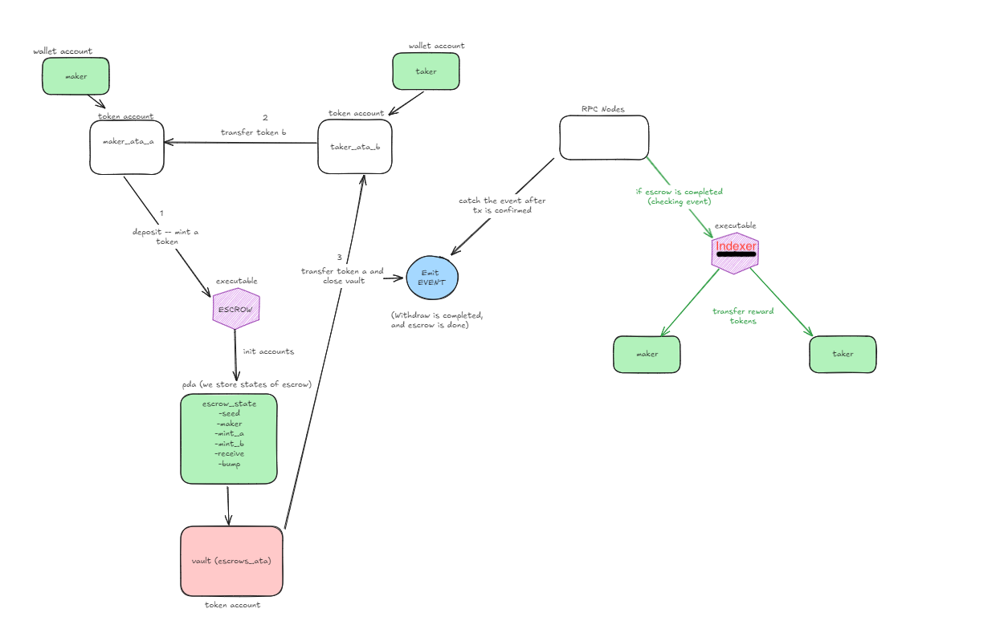

# Gifter Escrow

---

That is a web3 platform in which people can exchange their tokens and collect rewards after exchange.

> [!NOTE]
> Program ID: `9HP45DvSvMRNmb7KQTDnujtv49oDVNEEH8VCFTmdb5yf ` program is live on devnet.

> [!IMPORTANT]
> **Helius** RPC Nodes are used in that platform for better performance.

### Reward Token

In that platform, **10 million GFT** token is supplied for users and after each completed escrow, platform gives **1 GFT** for both users (dealers for the --> maker-taker)

The idea is to engage for more people into our platform. In Future plans, those **GFT** tokens will be monetized and useful on our platform for some utilities.

### User Stories

- As a user, I can create an escrow to exchange my tokens
- As a user, I can cancel my escrow by refunding tokens
- As a user, I can accept an escrow on the platform.

### Framework Stack

| Contract | Anchor |
| Backend | Typescript |
| Frontend | Nextjs |

An **indexer** for that project is written by `Typescript` and deployed to the `AWS EC2`. That indexer listens the RPC nodes and after a `completeEscrow` event is emitted from our program, a reward logic that transfers reward token for both maker and taker is run. You can check the source code of that indexer from that [link](https://github.com/berkaycirak/gifter-escrow-indexer)

### Architecture

_System design of the platform_
